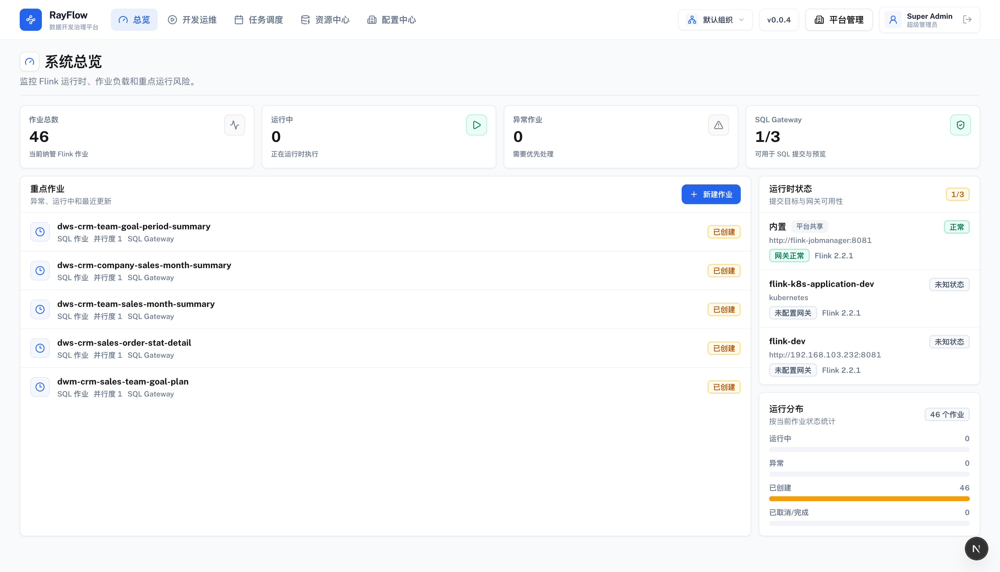
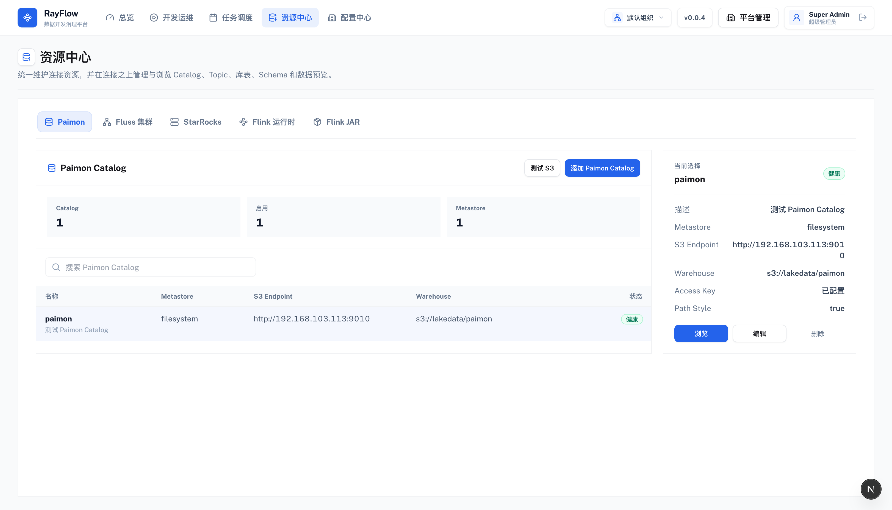
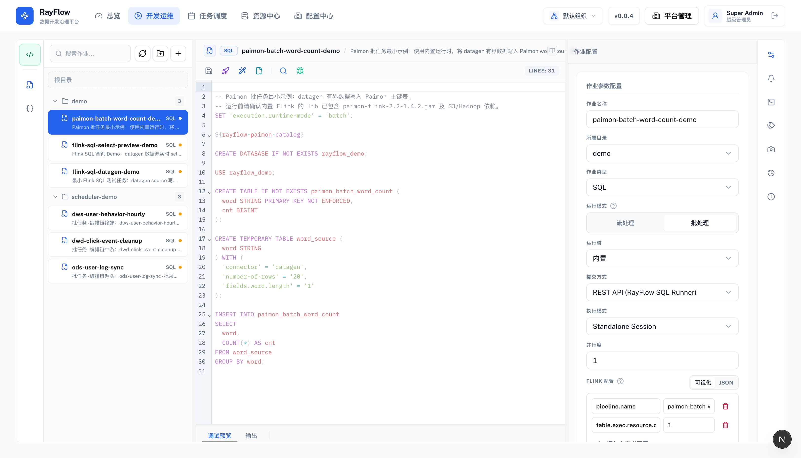
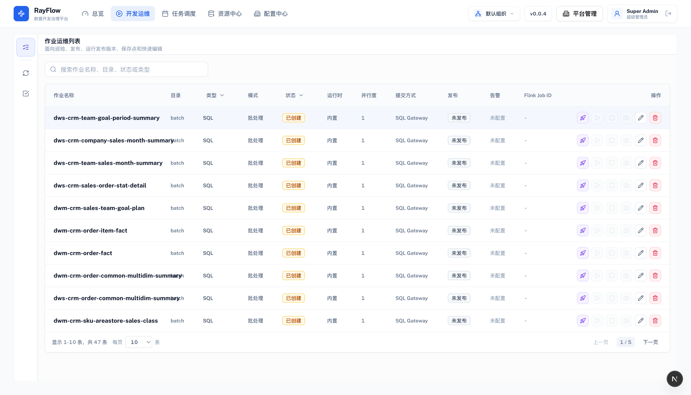
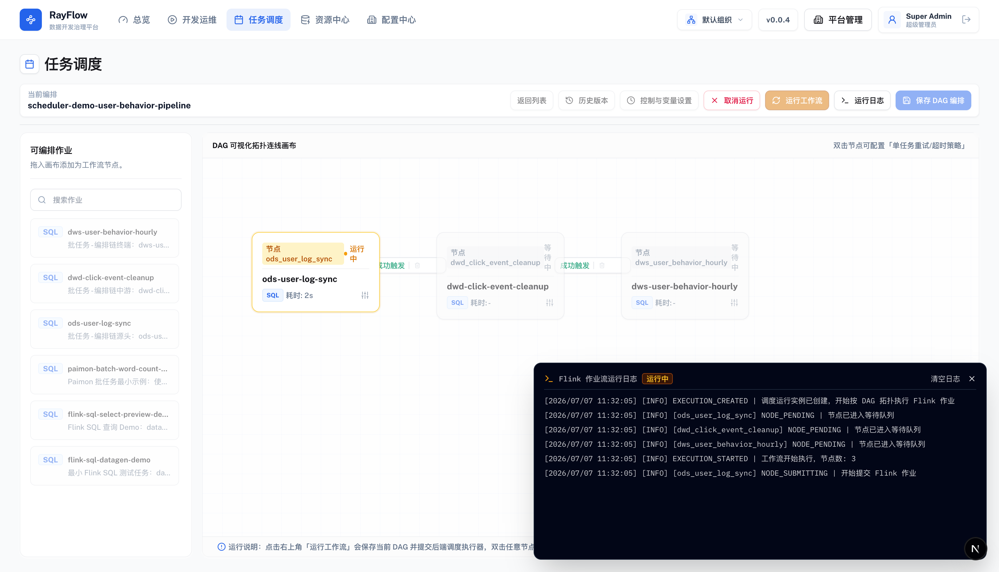
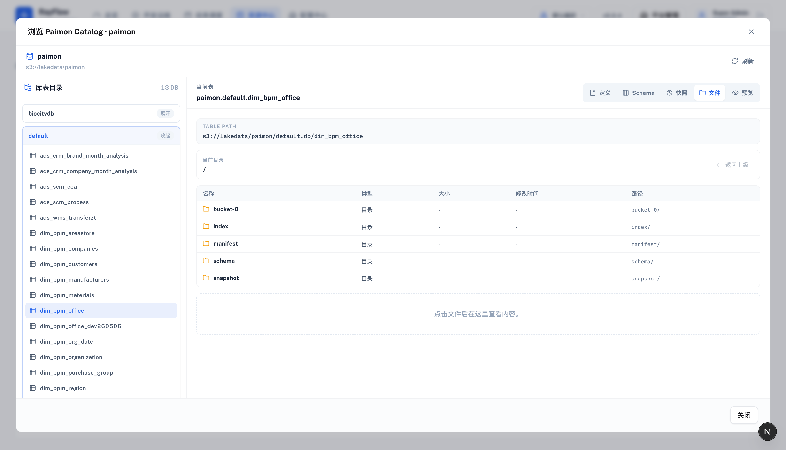
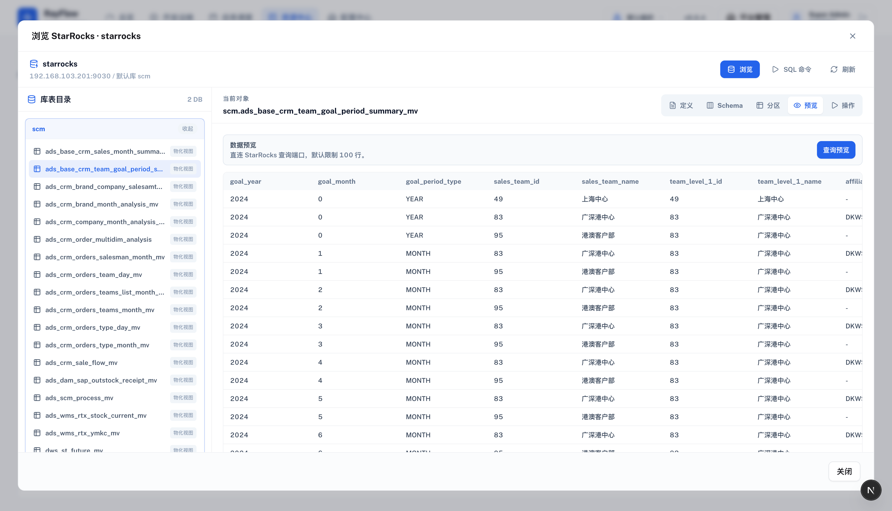
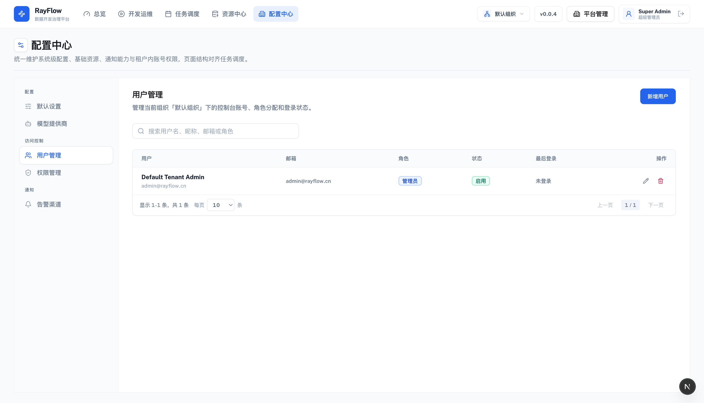

<div align="center">

# RayFlow

**企业级 Flink SQL/JAR 流批一体开发、资源管理与任务调度平台**

RayFlow 面向 Flink 作业研发与运维场景，提供开发作业、运行时托管、资源中心、配置中心、Paimon/StarRocks 浏览、工作流编排和执行审计能力。项目内置 Docker 开发环境，默认集成 PostgreSQL、Redis、RustFS、Flink、Admin 控制台、Docs 文档站和 Nginx 网关。

[](https://spring.io/)
[](https://openjdk.org/)
[](https://nextjs.org/)
[](https://react.dev/)
[](https://www.typescriptlang.org/)
[](https://flink.apache.org/)
[](https://paimon.apache.org/)
[](https://www.postgresql.org/)

[English](./README_EN.md) | 简体中文

[控制台](http://localhost:8080) | [文档中心](http://localhost:8003) | [Flink UI](http://localhost:8081) | [RustFS Console](http://localhost:9011)

<p>
  <a href="https://github.com/bulolo/RayFlow">
    
  </a>
</p>

**如果 RayFlow 对你有帮助，请点击右上角 Star 支持一下。**

</div>

---

## 项目亮点

- **一体化闭环**：开发作业、运行运维、资源管理、任务调度和执行日志在同一控制台完成。
- **Flink/Paimon 开箱即用**：`make setup-flink-paimon` 交互式准备 Flink、Paimon、CDC、Kafka、JDBC 和 filesystem 依赖。
- **湖仓资源浏览**：Paimon 支持元数据、表定义、快照、manifest、index、文件内容浏览；StarRocks 支持库表、分区、预览和常用操作。
- **SDK 优先对接**：后端 OpenAPI 驱动前端 TypeScript SDK，减少手写接口路径和类型漂移。
- **升级可控**：Flyway 管理数据库结构，Flink/Paimon 版本矩阵可校验，custom-lib 区分 RayFlow 托管依赖和用户自定义依赖。
- **本地开发友好**：一套 Makefile 收口 dev/prod、检查、格式化、SDK、迁移、测试数据和运行依赖。

---

## 最近更新

### v1.0.0 - 企业级 Flink 流批一体开发运维平台

- **开发运维闭环**：完成 SQL/JAR 作业开发、变量管理、SQL 校验、格式化、预览、提交、运行状态追踪和 Flink UI 跳转。
- **资源中心升级**：统一管理 Flink 运行时、Paimon Catalog、StarRocks 数据源、JAR 资源和对象存储依赖。
- **湖仓浏览能力**：Paimon 支持 database/table/schema/表定义/快照/manifest/index/文件内容浏览；StarRocks 支持库表、预览、分区和常用操作。
- **任务调度闭环**：支持基于 DAG 的工作流编排，用于串行编排开发运维内的 Flink 作业，并提供执行记录与日志审计。
- **多租户与平台管理**：支持超级管理员跨租户管理、租户管理员初始化、租户内用户隔离和配置中心统一维护。
- **Flink/Paimon 运行环境工具化**：新增 `make setup-flink-paimon`、`make verify-flink-libs`、`make verify-flink-paimon-matrix`，支持交互式准备 Flink/Paimon/CDC/Kafka 依赖。
- **工程规范收口**：统一 API 响应、分页结构、OpenAPI SDK 生成、Flyway 数据库迁移、Makefile 检查命令和前后端代码组织。
- **开发体验优化**：Admin 支持 URL 直达开发/运维视图和指定作业，统一弹窗、提示、字体、编辑器样式和资源浏览窗口体验。

---

## 项目定位

RayFlow 不是单纯的 Flink SQL 编辑器，而是围绕“作业从开发到运维再到编排”的完整平台：

- **开发运维一体**：开发视图管理 SQL/JAR 作业，运维视图跟踪运行状态、Flink Job ID、启动、停止、删除和状态刷新。
- **资源中心**：统一维护 Flink 运行时、Paimon Catalog、StarRocks 数据源、JAR 资源等连接资产。
- **配置中心**：统一管理租户用户、变量、通知渠道、模型提供商和系统配置。
- **任务调度**：用 DAG 工作流编排开发运维里的 Flink 作业，支持串行依赖、运行记录和执行日志。
- **湖仓浏览**：Paimon 支持 catalog/database/table/schema/快照/manifest/index 文件浏览；StarRocks 支持库表浏览、预览、分区和常用操作。
- **生产级工程规范**：Flyway 管理数据库迁移，OpenAPI 生成前端 SDK，Makefile 收口本地开发、检查、迁移和运行依赖。

---

## 核心技术栈

RayFlow 当前围绕 **Apache Flink + Apache Paimon + StarRocks + Apache Fluss** 构建数据开发与运维控制面。下面展示的是各项目官方 Logo 资源，便于快速识别平台技术底座。

<table>
  <tr>
    <td align="center" width="25%" valign="top">
      <a href="https://flink.apache.org/" target="_blank">
        
      </a>
      <br><b>Apache Flink</b>
      <br><sub>默认 2.2.1</sub>
      <br><sub>SQL/JAR 流批一体计算、作业提交、状态同步与 Flink UI 跳转。</sub>
    </td>
    <td align="center" width="25%" valign="top">
      <a href="https://paimon.apache.org/" target="_blank">
        
      </a>
      <br><b>Apache Paimon</b>
      <br><sub>默认 1.4.2</sub>
      <br><sub>湖仓表存储、Catalog、库表、Schema、快照、manifest、index 与文件浏览。</sub>
    </td>
    <td align="center" width="25%" valign="top">
      <a href="https://www.starrocks.io/" target="_blank">
        
      </a>
      <br><b>StarRocks</b>
      <br><sub>实时分析库</sub>
      <br><sub>库表浏览、Schema、分区、数据预览、SQL 命令与物化视图操作。</sub>
    </td>
    <td align="center" width="25%" valign="top">
      <a href="https://fluss.apache.org/" target="_blank">
        
      </a>
      <br><b>Apache Fluss</b>
      <br><sub>Incubating</sub>
      <br><sub>湖流一体实时数据管道方向，当前提供集群登记与 Topic 管理入口。</sub>
    </td>
  </tr>
</table>

> Logo 来源：Apache Flink 官方 Material 页面、Apache Paimon 官网、StarRocks 官网、Apache Fluss 官方 Logo 页面。

---

## 界面预览

<table>
  <tr>
    <td width="50%">
      
      <p align="center"><b>控制台总览</b><br>汇总作业状态、资源健康、调度执行与近期操作入口。</p>
    </td>
    <td width="50%">
      
      <p align="center"><b>资源中心</b><br>集中管理 Flink、Paimon、StarRocks、JAR 等连接资产。</p>
    </td>
  </tr>
  <tr>
    <td width="50%">
      
      <p align="center"><b>开发作业编辑器</b><br>Flink SQL/JAR 作业研发、变量、校验、格式化与提交。</p>
    </td>
    <td width="50%">
      
      <p align="center"><b>开发运维视图</b><br>作业状态、Flink Job ID、运行操作和运维筛选。</p>
    </td>
  </tr>
  <tr>
    <td width="50%">
      
      <p align="center"><b>任务调度</b><br>基于 DAG 编排开发运维内的 Flink 作业，查看版本、运行状态与执行日志。</p>
    </td>
    <td width="50%">
      
      <p align="center"><b>Paimon 湖仓浏览</b><br>Catalog、Database、Table、表定义、快照、manifest 与数据文件浏览。</p>
    </td>
  </tr>
  <tr>
    <td width="50%">
      
      <p align="center"><b>StarRocks 管理</b><br>库表浏览、SQL 命令、数据预览、分区与物化视图常用操作。</p>
    </td>
    <td width="50%">
      
      <p align="center"><b>配置中心</b><br>租户内用户、权限、模型服务、通知渠道与默认参数统一维护。</p>
    </td>
  </tr>
</table>

---

## 当前默认栈

| 层级 | 技术 |
| --- | --- |
| 后端 | Java 17, Spring Boot 3.3.6, MyBatis-Plus, Flyway, Maven |
| 前端 Admin | Next.js 16.1.6, React 19.2, TypeScript 5.9, React Query, Orval SDK, Tailwind CSS, CodeMirror |
| 文档站 | VitePress 2.0 alpha |
| 官网 | Next.js 16.1.6 |
| 数据服务 | PostgreSQL 16, Redis 7, RustFS |
| 计算与湖仓 | Flink 2.2.1, Paimon 1.4.2, Flink CDC 3.5.0, Kafka SQL Connector 5.0.0-2.2 |
| 开发入口 | Nginx `http://localhost:8080` |

---

## 功能概览

### 开发运维

- SQL/JAR 作业统一管理，支持分组、变量、SQL 校验、格式化、预览、提交与状态追踪。
- 开发视图和运维视图支持 URL 直达：`/development?view=develop`、`/development?view=ops`。
- 开发作业支持直达：`/development?view=develop&jobId=123`。
- SQL 编辑器针对 Flink SQL 变量 `${var}`、Paimon DDL、复杂 ROW/ARRAY 类型做了格式化与诊断优化。
- 运维列表支持状态轮询、Flink UI 跳转和批/流任务区分。

### 资源中心

- Flink 运行时：内置运行时默认指向 Docker Compose 中的 Flink REST 和 SQL Gateway。
- Paimon Catalog：支持元数据缓存、手动刷新、schema、表定义、快照、manifest、index 和文件内容浏览。
- StarRocks：支持连接测试、库表浏览、表数据预览、SQL 命令、分区查看和物化视图常用操作。
- JAR 资源：支持上传到对象存储，作为 JAR 作业主包或 SQL 作业依赖。

### 任务调度

- 工作流本质是编排“开发运维”中的 Flink 作业。
- 节点按依赖异步串行推进：上游 Flink 作业结束后才继续下游。
- 失败节点会记录运行状态和执行日志，便于追踪 Flink 提交与运行问题。
- 当前已支持初始化 `scheduler-demo` 作业和演示工作流数据。

### 多租户与权限

- 平台超级管理员可以跨租户管理。
- 租户内用户管理不展示超级管理员。
- 创建组织时需要指定初始租户管理员。
- 默认开发账号由 `backend/.env` 管理。

---

## 快速开始

### 1. 环境要求

- Docker Desktop / Docker Engine
- Docker Compose v2
- Make
- Java 17
- Maven 3.9+
- Node.js 22+
- pnpm 10+

> 后端本地编译建议使用 Java 17。若本机默认 Java 太新，可通过 `BACKEND_JAVA_HOME` 或 macOS `/usr/libexec/java_home -v 17` 指定。

### 2. 初始化配置

```bash
make dev-init
```

该命令会从 [backend/.env.example](./backend/.env.example) 生成 `backend/.env`，并填充开发环境默认值。已有 `backend/.env` 时不会覆盖。

### 3. 准备 Flink/Paimon 运行依赖

```bash
make setup-flink-paimon
```

交互式终端会提示版本，直接回车使用默认值：

```text
Flink 版本或版本线 [2.2]:
Paimon 版本 [1.4.2]:
Flink CDC Connector 版本 [3.5.0]:
Flink Kafka Connector 版本 [5.0.0-2.2]:
MySQL 驱动版本 [8.0.27]:
Flink Shaded Hadoop 版本 [2.8.3-10.0]:
是否清理旧版本托管依赖？1=是，0=否 [1]:
是否强制重新下载？1=是，0=否 [0]:
```

非交互指定版本线，脚本会解析到该线最新 patch，并将精确版本写入 `backend/.env`：

```bash
make setup-flink-paimon FLINK_VERSION=2.1 PAIMON_VERSION=1.4.2
```

例如当前 Maven 元数据中 `2.2 -> 2.2.1`、`2.1 -> 2.1.3`。脚本会自动推导 Paimon Flink 适配线，例如 `2.1.3 -> paimon-flink-2.1`，并按需清理旧版本托管依赖，避免 Flink 同时加载不兼容 jar。

依赖目录：

```text
deploy/docker/flink/custom-lib/
  rayflow/      RayFlow 托管依赖，由 make setup-flink-paimon 管理
    paimon/     Paimon runtime/action/S3
    cdc/        MySQL/Postgres/MongoDB/SQL Server CDC connector
    messaging/  Kafka SQL connector
    jdbc/       JDBC driver
    filesystem/ Hadoop/filesystem 相关 jar
  custom/       用户自定义 jar，setup 不清理
```

### 4. 启动开发环境

```bash
make dev-up
```

默认入口：

| 服务 | 地址 |
| --- | --- |
| Admin 控制台 | http://localhost:8080 |
| Backend API | http://localhost:3000 |
| API Health | http://localhost:3000/api/health |
| Flink Web UI | http://localhost:8081 |
| Flink SQL Gateway | http://localhost:8083 |
| RustFS S3 API | http://localhost:9010 |
| RustFS Console | http://localhost:9011 |
| Docs 文档站 | http://localhost:8003 |
| PostgreSQL | localhost:5433 |
| Redis | localhost:6379 |

开发默认账号：

| 角色 | 账号 | 密码 |
| --- | --- | --- |
| 超级管理员 | `superadmin@rayflow.cn` | `admin123` |
| 默认租户管理员 | `admin@rayflow.cn` | `admin123` |

Website 官网默认不随 `make dev-up` 启动，如需启动：

```bash
docker compose --env-file backend/.env -f docker-compose.dev.yml --profile website up website
```

### 5. 初始化测试数据

```bash
make init-test
```

该命令会向开发 PostgreSQL 写入默认租户、资源、作业、调度 demo、Paimon batch demo 等测试数据。

---

## 常用命令

| 命令 | 说明 |
| --- | --- |
| `make help` | 查看全部项目命令 |
| `make dev-init` | 初始化开发环境配置 |
| `make setup-flink-paimon` | 交互式准备 Flink/Paimon/CDC/Kafka 运行依赖 |
| `make verify-flink-libs` | 校验 `custom-lib` 下 jar 是否完整可读 |
| `make verify-flink-paimon-matrix` | 校验 Flink 2.x + Paimon 1.x artifact 可用矩阵 |
| `make dev-up` | 前台启动开发环境 |
| `make dev-rebuild` | 后台重建并启动开发环境 |
| `make dev-down` | 停止开发环境 |
| `make dev-clean` | 清理业务数据卷，保留 Maven 缓存 |
| `make dev-purge` | 清理业务数据卷和 Maven 缓存 |
| `make run-backend` | 本机启动后端 |
| `make run-admin` | 本机启动 Admin 前端 |
| `make run-docs` | 本机启动文档站 |
| `make build-backend` | Maven 编译后端 |
| `make build-admin` | 构建 Admin |
| `make gen-swagger` | 从后端拉取 OpenAPI |
| `make gen-sdk` | 基于 OpenAPI 生成前端 SDK |
| `make format` | 前端可修复问题自动修复 |
| `make check-admin` | Admin lint + typecheck |
| `make check-backend` | 后端 compile + migration verify |
| `make check-all` | 全量检查 |
| `make migration-new desc=add_xxx` | 创建当前版本分支的 Flyway migration |
| `make migration-verify` | 校验数据库迁移规范 |
| `make migrate-streampark-batch` | 从 StreamPark 迁移 batch 标签作业 |
| `make set-version v=0.0.4` | 统一修改项目版本号 |

---

## Flink/Paimon 版本矩阵

快速检查 Maven artifact 是否存在：

```bash
make verify-flink-paimon-matrix
```

当前验证通过的 Flink 2.x + Paimon 1.x 范围：

| Flink 适配线 | 可用 Paimon 1.x | Kafka SQL Connector |
| --- | --- | --- |
| 2.0 | 1.1.0, 1.1.1, 1.2.0, 1.3.1, 1.3.2, 1.4.1, 1.4.2 | 4.0.1-2.0 |
| 2.1 | 1.3.1, 1.3.2, 1.4.1, 1.4.2 | 5.0.0-2.1 |
| 2.2 | 1.4.1, 1.4.2 | 5.0.0-2.2 |

如需真实下载并校验全量矩阵 jar：

```bash
DOWNLOAD=1 make verify-flink-paimon-matrix
```

该命令会下载多个大 jar，仅在升级兼容性验证时使用。

---

## 前后端 SDK 规范

Admin 前端通过 OpenAPI 生成 SDK，业务代码应优先使用生成的方法和类型，避免手写接口路径。

常规流程：

```bash
make gen-swagger
make gen-sdk
```

生成入口：

```text
frontend/admin/src/shared/api/generated/
```

后端 API 响应结构统一为：

```json
{
  "code": 0,
  "data": {},
  "msg": "success"
}
```

分页响应统一为 `list/pagination` 风格：

```json
{
  "code": 0,
  "data": {
    "list": [],
    "pagination": {
      "is_pager": 1,
      "page": 1,
      "size": 10,
      "total": 0,
      "pages": 0
    }
  },
  "msg": "success"
}
```

---

## 数据库迁移规范

RayFlow 使用 Flyway 管理结构变更：

- migration 文件位于 `backend/rayflow-server/src/main/resources/db/migration`。
- 当前基线文件为 `V0.0.1__init_schema.sql`。
- `scripts/init-test.sql` 只维护测试数据，不承载结构变更。
- `scripts/init-db.sql` 已废弃，不作为升级依据。
- 新增结构变更使用 `make migration-new desc=add_xxx` 创建模板。

常用命令：

```bash
make migration-new desc=add_scheduler_indexes
make migration-verify
```

详细说明见 [docs/database-migrations.md](./docs/database-migrations.md)。

---

## 项目结构

```text
RayFlow/
  backend/
    rayflow-common/             公共模型、响应结构、工具类
    rayflow-flink-core/         Flink REST/SQL Gateway 对接核心
    rayflow-flink-sql-runner/   SQL Runner 作业模块
    rayflow-server/             Spring Boot 主服务
  frontend/
    admin/                      Next.js 管理控制台
    docs/                       VitePress 文档站
    website/                    官网展示项目
  deploy/
    docker/flink/custom-lib/    Flink 扩展依赖挂载目录
    nginx/                      Nginx 配置
    docker-compose.yml          生产 Compose
  docs/                         工程文档
  scripts/                      初始化、迁移、SDK、版本和依赖脚本
  docker-compose.dev.yml        开发环境 Compose
  Makefile                      项目命令入口
```

---

## 文档快速导航

- [架构说明](./docs/architecture.md) - 后端、前端、资源中心和部署拓扑说明。
- [REST API 说明](./docs/api.md) - API 设计、响应结构和认证约定。
- [数据库迁移规范](./docs/database-migrations.md) - Flyway migration 命名、边界和校验规则。
- [Flink Runtime Roadmap](./docs/flink-runtime-roadmap.md) - Flink 运行时能力规划。
- [SQL Preview Plan](./docs/sql-preview-plan.md) - SQL 预览执行链路和回调设计。
- [Docs 文档站源码](./frontend/docs/docs) - VitePress 文档内容目录。

---

## 常见问题

### `make setup-flink-paimon` 下载时出现 TLS 或 Maven 连接错误

脚本默认使用多个 Maven 源重试：

```text
https://maven.aliyun.com/repository/public
https://repo.maven.apache.org/maven2
https://repo1.maven.org/maven2
```

如果网络仍不稳定，可以重新执行命令。已下载且校验通过的 jar 会跳过。

### Flink 启动后没有加载 custom-lib 里的 jar

确认 `FLINK_LIB_DIR` 指向：

```text
./deploy/docker/flink/custom-lib
```

开发和生产 Compose 会将该目录挂载到 `/opt/rayflow/flink-lib`，并递归复制所有 `*.jar` 到 `/opt/flink/lib`。

### Flink UI 跳转打不开

资源中心里的 Flink REST 地址需要对浏览器可访问。开发环境浏览器地址通常是：

```text
http://localhost:8081
```

容器内部地址 `http://flink-jobmanager:8081` 只适合后端服务访问，不适合作为浏览器跳转地址。

### `make check-backend` 使用了错误的 Java 版本

后端需要 Java 17。macOS 可使用：

```bash
make check-backend BACKEND_JAVA_HOME="$(/usr/libexec/java_home -v 17)"
```

### Website 为什么没有随开发环境启动

Website 是独立前台项目，开发环境默认只启动 Admin 和 Docs。需要时用 Compose profile 单独启动，避免主开发链路过重。

---

## 许可证与商业用途

本项目采用 RayFlow 开源许可证，基于 Apache 2.0 思路增加品牌与 SaaS 使用限制：

- 个人和企业内部使用免费。
- 不得移除或修改 UI、控制台、API 响应等位置的 RayFlow 品牌标识。
- 未经书面授权，不得基于本项目提供营利性多租户 SaaS 服务。

完整条款见 [LICENSE](./LICENSE)。

---

<div align="center">

## 联系方式

**问题反馈**: [GitHub Issues](https://github.com/bulolo/RayFlow/issues) &nbsp; | &nbsp; **商务合作**: support@bulolo.cn / bulolo (微信)

<br>


<br>
<sub>扫码加入社区 (备注: RayFlow)</sub>

</div>

---

<div align="center">

**如果 RayFlow 对你有帮助，欢迎给项目一个 Star。**

Made with ❤️ by RayFlow Team

</div>

---

## 生态推荐

如果 RayFlow 负责把“数据计算作业”管理起来，也可以看看这些姊妹项目：

- **[CatWiki](https://github.com/bulolo/CatWiki)** - 企业级 AI 知识库平台，面向知识管理、文档解析和 Agentic RAG 问答场景。
- **[OwlApi](https://github.com/bulolo/OwlApi)** - 数据快速变成 API 的开发工具，适合把数据库和数据源转为标准化、可治理的 REST API。
